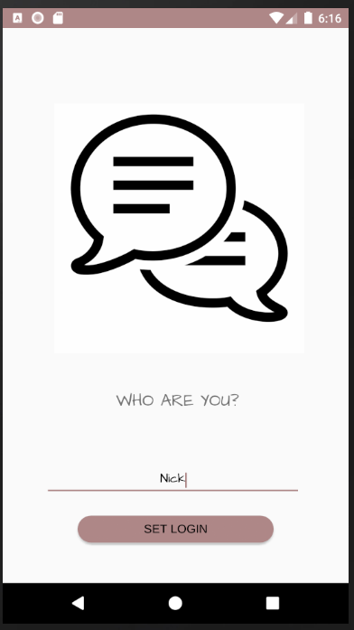
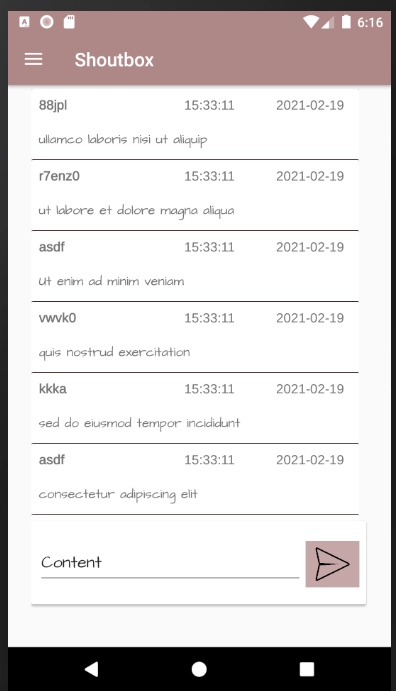
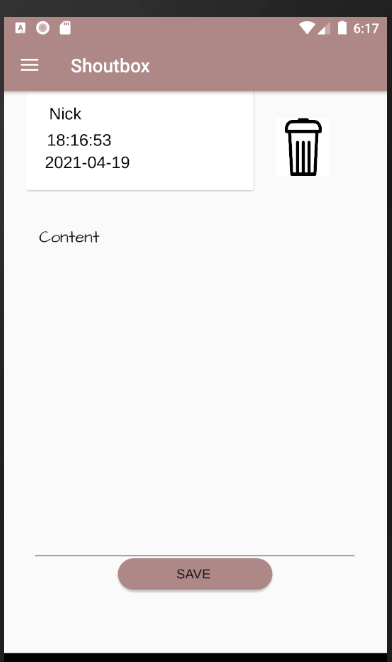

# shoutbox-android
> Mini chat app that gets messages from API.

## Technologies
* Kotlin
* Android Studio

## Screenshots

App allows you to set your name, before you enter the chat.

Once you set your name you can send new messages.

 If you click on your messages you can go to the view where you can edit it or delete.

